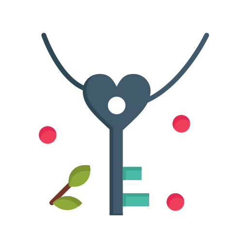

# Caesar Cipher

    

    The Caesar's Cipher Encoder and Decoder

This is an encoder and a decoder of Caesar's cipher.

## Usage

In the project directory, you can run:

### `rake build`

Runs the app.

### `rake format`

Runs the code formatter.

### `rake lint`

Runs the code linters.

### `rake test`

Launches the test runner.
